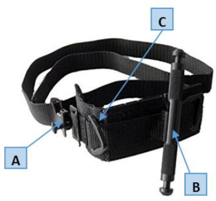
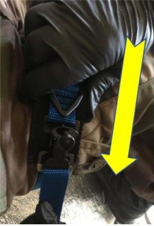
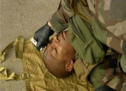

Dernière Version : 01/12/2018

.. _ha1c161c3a7d1d5671d23b40d7057:

Fiche FT - GARROT TACTIQUE - 1.FT.M.01 - 
#########################################

.. _h2d6147a1c20493e66189273332373c:

Description :
*************

* Le garrot réglementaire est le SOF®T ;

* Il se compose d’une sangle, d’un système de serrage (A), d’une barre métallique (B) et un ou deux triangles de blocage (C) ;

* De nombreux autres modèles existent. Ne \ |STYLE0|\  choisir de contrefaçon.

\ |IMG1|\ 

.. _h1a2e7b656967f644437b611633e22:

Comment :
*********

Le garrot tactique se pose sur la partie la plus haute (racine) du membre (la cuisse ou le bras) qui saigne, optimisant ainsi les chances d’être au-dessus de l’hémorragie. Celui-ci peut être posé par le combattant lui-même en première intention. 

\ |STYLE1|\  

#. \ |STYLE2|\  des gants à usage unique, à défaut, les gants de combat ; 

#. \ |STYLE3|\  le garrot à la racine du membre (en laissant la place pour qu’un second garrot puisse être rajouté) ; 

#. \ |STYLE4|\  la bande de tissu au maximum ;

#. \ |STYLE5|\  la barre métallique de serrage au maximum ou alors jusqu’à l’arrêt du saignement (ce geste \ |STYLE6|\  ne doit pas interrompre la mise en place) ; 

#. \ |STYLE7|\  l’arrêt de saignement ;

#. Bloquer la barre métallique dans un des petits triangles plastiques, dont un est mobile ;

#. \ |STYLE8|\  la molette pour éviter qu’un choc ne desserre secondairement le garrot ; 

#. \ |STYLE9|\  sur le front du blessé avec un marqueur permanent la lettre « T » correspondant à « Tourniquet » qui signifie « garrot » en anglais, ainsi que l’heure de la pose à 4 chiffres (ex 13h23). 

\ |IMG2|\ 	

\ |STYLE10|\  

\ |STYLE11|\ 

\ |STYLE12|\  

* Lors de la perception initiale, il est recommandé de l’assouplir en le manipulant, et de le positionner prêt à l’emploi (boucle formée à la taille de son propre membre supérieur, barre de serrage au contact du tissu, vis desserrée), la constatation de toute anomalie nécessite un changement immédiat auprès du Role 1;  

* Avant chaque mission, contrôler la présence de la vis et vérifier que les dents de la boucle ne soient pas usées;  

* Il est nécessaire de contrôler régulièrement, voire de resserrer un garrot déjà posé;  

* En cas d’inefficacité, un second garrot devra être posé ;  

* Une fois posé, la pertinence du garrot sera réévaluée régulièrement par un SC3 avec conversion dès que possible (Cf. 1.FT.M.08).

.. _h2e313d019511f803596747505d1332:

Risques :
*********

#. Décès rapide du blessé si garrot :  

    * Mal posé ou non sécurisé ;  

    * Mal serré ;  

    * Posé tardivement. 

#. Amputation du membre :  

    * Envisagée par le chirurgien au-delà de 6 heures de pose en continu 

#. Utiliser un garrot contrefait, usé, ancien rendu fragile et/ou inefficace.

.. _h263929452b3b581f697c6c2861b2e28:

Critère d’efficacité :
**********************

Arrêt du saignement.

.. _h736e5552573b1a3d8711e6b61704a7a:

A Retenir :
***********

* Le placer au plus haut (racine) du membre ; 

* Ordre de mise en place : Serrer/Tourner/Vérifier/Bloquer/Visser/Noter l’heure ; 

* Un garrot est douloureux, ne pas interrompre la pose, ne pas desserrer en cas de couleur : intérêt de l’administration de morphine ; 

* Réévaluation dès que possible par un SC3.

.. bottom of content

.. |STYLE0| replace:: **jamais**

.. |STYLE1| replace:: **Poser le garrot :**

.. |STYLE2| replace:: **Enfiler**

.. |STYLE3| replace:: **Mettre en place**

.. |STYLE4| replace:: **Serrer**

.. |STYLE5| replace:: **Tourner**

.. |STYLE6| replace:: **est douloureux ! mais**

.. |STYLE7| replace:: **Vérifier**

.. |STYLE8| replace:: **Visser**

.. |STYLE9| replace:: **Noter**

.. |STYLE10| replace:: *S’il est impossible d’écrire sur le front, écrire sur une partie visible du blessé ou sur le garrot lui-même (sur certains garrots, une étiquette est prévue à cet effet).*

.. |STYLE11| replace:: *Ne jamais écrire l’heure de pose sur les vêtements (risque de découpage de tenue lors de la prise en charge).*

.. |STYLE12| replace:: **Points particuliers :**

